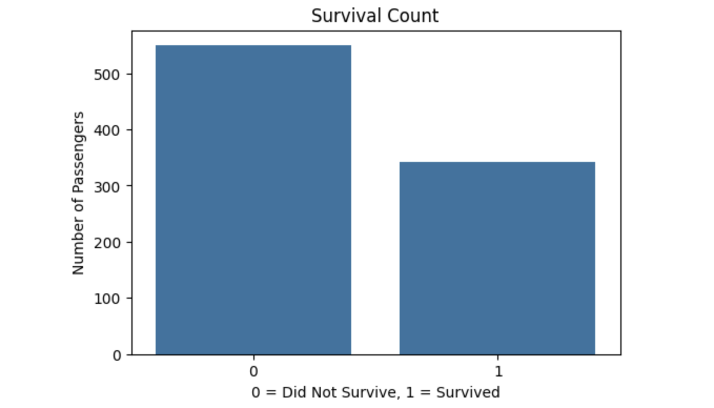
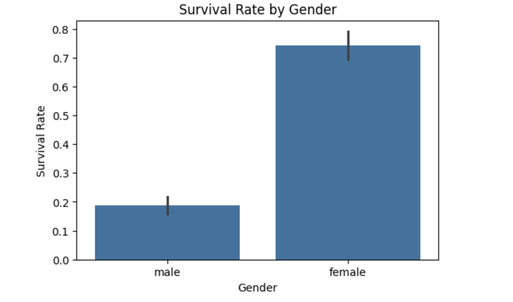
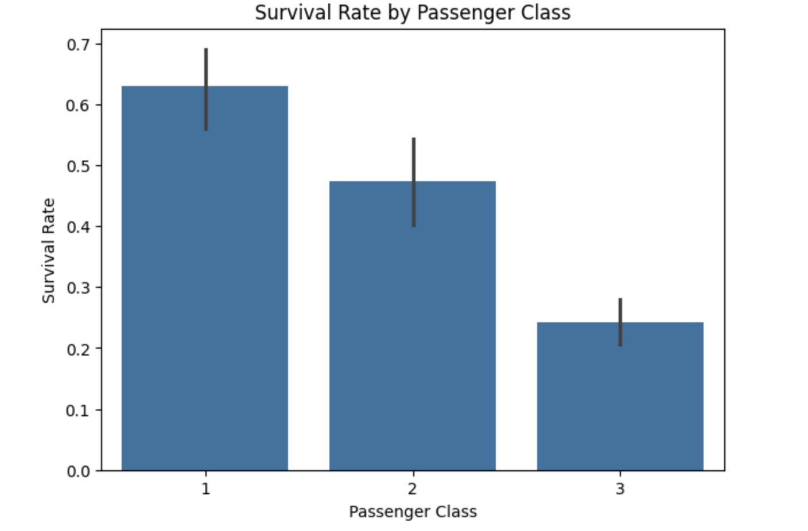
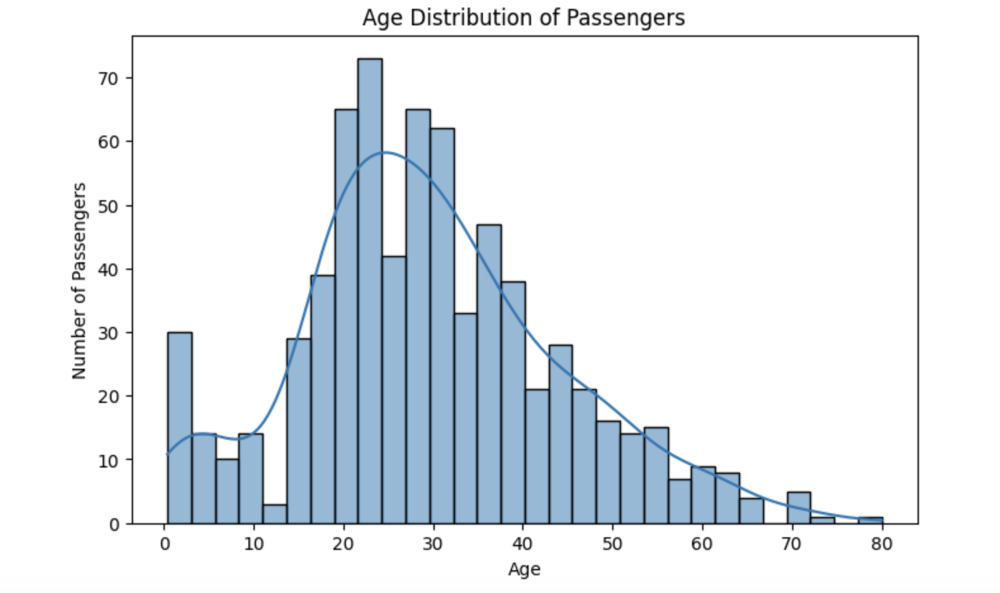
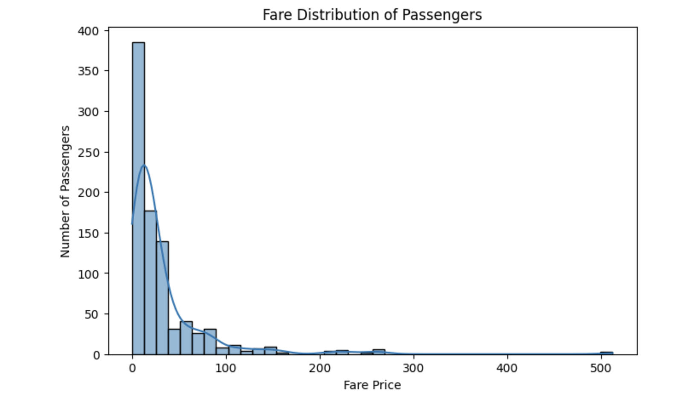

# 🚢 Titanic Dataset Analysis

## 📌 Project Overview
This project focuses on analyzing the Titanic dataset using **Exploratory Data Analysis (EDA)** and **Data Visualization techniques**. The goal is to understand passenger survival patterns and identify relationships between different features such as gender, age, passenger class, and fare price.

---

## 🎯 Project Objectives
The main objectives of this project are:

- Understand the dataset structure
- Identify missing values
- Explore trends and patterns
- Visualize survival statistics
- Analyze the relationship between gender, passenger class, age, and survival

---

## 📂 Dataset Information
The dataset used in this project is the **Titanic Dataset**, which contains passenger information such as:

- Passenger Class (`Pclass`)
- Gender (`Sex`)
- Age
- Fare Price
- Survival Status
- Embarked Location

---

## 🛠️ Technologies Used
- Python
- Pandas
- Matplotlib
- Seaborn
- Google Colab

---

## 📊 Exploratory Data Analysis (EDA)
The following analysis was performed:

### 1. Dataset Understanding
- Checked dataset structure
- Explored columns and data types
- Viewed dataset information

### 2. Missing Values Analysis
- Identified null values in the dataset
- Checked missing data distribution

### 3. Statistical Summary
- Generated descriptive statistics using `describe()`

### 4. Data Visualization
Created visualizations such as:

- Survival Count
- Survival Rate by Gender
- Age Distribution of Passengers
- Survival Rate by Passenger Class
- Fare Price Distribution

---

## 🔍 Key Insights
- Female passengers had a higher survival rate than male passengers.
- First-class passengers survived more often compared to third-class passengers.
- Most passengers were between 20–40 years of age.
- Fare prices were highly skewed with some outliers.

---

## ▶️ How to Run the Project

1. Clone this repository
2. Open the notebook in Google Colab or Jupyter Notebook
3. Run all cells

----

## 📊 Data Visualizations

### Survival Count


### Survival Rate by Gender


### Survival Rate by Passenger Class


### Age Distribution of Passengers


### Fare Distribution of Passengers


---

## 👨‍💻 Author

**Arvind Yadav**  
MCA Student | Data Analytics Enthusiast | AI & ML Learner

---

## ⭐ Internship Project
This project was completed as part of the **CodeAlpha Data Analytics Internship**.

---

## 💼 Business Problem
The Titanic disaster is one of the most famous shipwrecks in history. This project analyzes passenger data to identify the key factors that influenced survival rates and understand patterns among different passenger groups.

---

## 📈 Business Insights
After performing Exploratory Data Analysis (EDA), the following insights were identified:

✅ Female passengers had significantly higher survival rates than male passengers.

✅ First-class passengers had a better chance of survival compared to second and third-class passengers.

✅ Most passengers were between 20–40 years old.

✅ Fare prices were highly skewed, indicating the presence of premium-class passengers paying significantly higher fares.

✅ Passenger class and gender played a major role in survival probability.

---

## 🧠 Skills Demonstrated
This project demonstrates practical skills in:

- Data Cleaning
- Exploratory Data Analysis (EDA)
- Data Visualization
- Statistical Analysis
- Python Programming
- Pandas for Data Manipulation
- Matplotlib & Seaborn for Visualization

---

## 📁 Project Structure

```bash
CodeAlpha_Data_Analytics/
│── CodeAlpha_Data_Analytics.ipynb
│── README.md
│── survival_count.png
│── gender_survival.png
│── passenger_class.png
│── age_distribution.png
│── fare_distribution.png
```

---

## 🚀 Future Improvements
Future enhancements for this project may include:

- Applying Machine Learning models for survival prediction
- Feature engineering for better analysis
- Interactive dashboards using Power BI or Tableau
- Advanced statistical insights

---

## 🏁 Conclusion
This project successfully analyzed the Titanic dataset to understand survival patterns using Exploratory Data Analysis (EDA). The analysis revealed important relationships between passenger survival and features such as gender, passenger class, age, and fare price.

